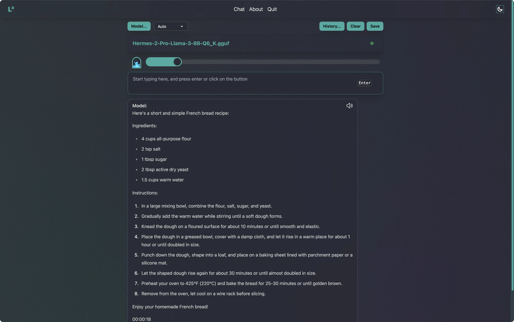
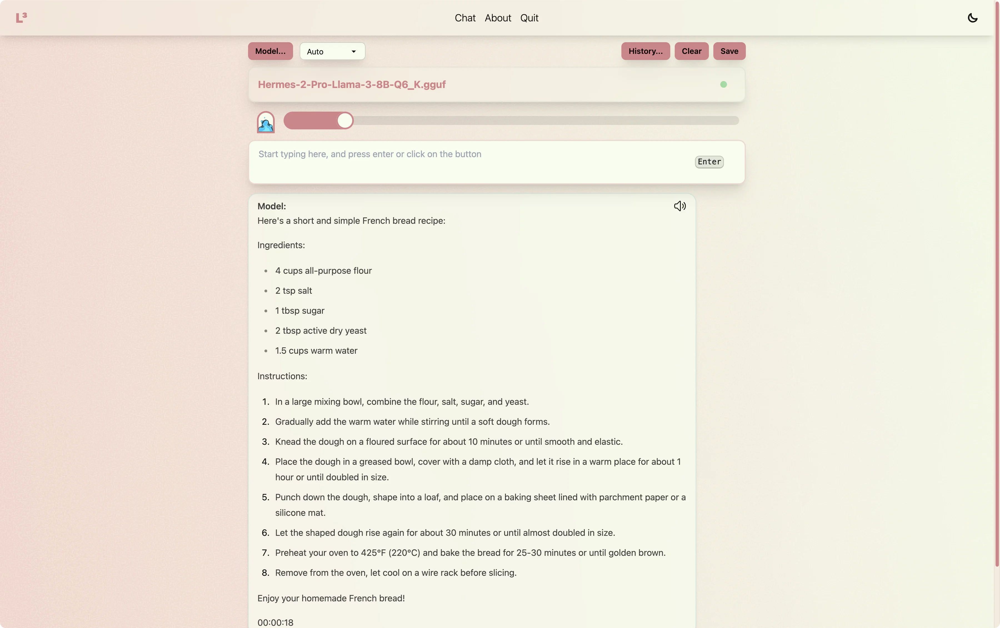
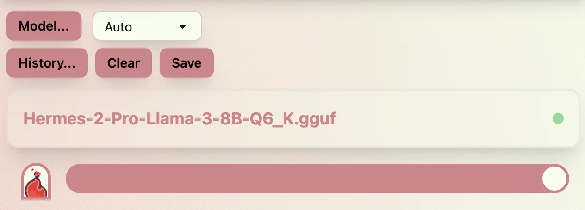
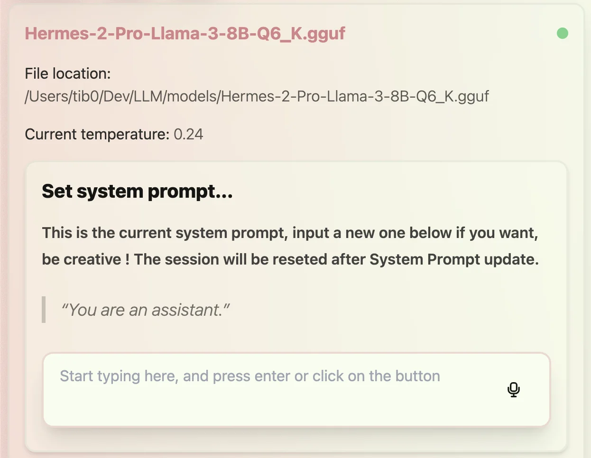

# local-llama

Local Llama is an electron app that runs Llama 3 models locally.

## Feature

 - ✅ Locally run llama models
 - ✅ Use GPU or CPU
 - ✅ Set temperature
 - ✅ Customize system prompt
 - ✅ Save conversation history

## Installation

Download the latest release from [here](https://github.com/tib0/local-llama/releases).

## Screens

### Dark theme

 

### Light theme



## App settings

Settings are available in the app.
 

You can customize your system prompt
 

## Project Setup

### Install

```bash
$ npm i
```

### Development

```bash
$ npm run dev
```

### Build

```bash
$ npm run build
```

### Package

```bash
$ npm run package
```

### Make

```bash
$ npm run make
```

## Made with

 
 **React**
 
 **Electron**
 
 **Forge**
 
 **Tailwind CSS**
 
 **DaisyUI**
 
 **electron-forge-plugin-vite-esm**: Fix the issue with esm interop embeded in electron app [here](https://github.com/fozziethebeat/electron-forge-plugin-vite-esm).
 
 **node-llama-cpp**: Awsome node wrapper for llama [here](https://github.com/withcatai/node-llama-cpp).


