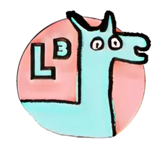
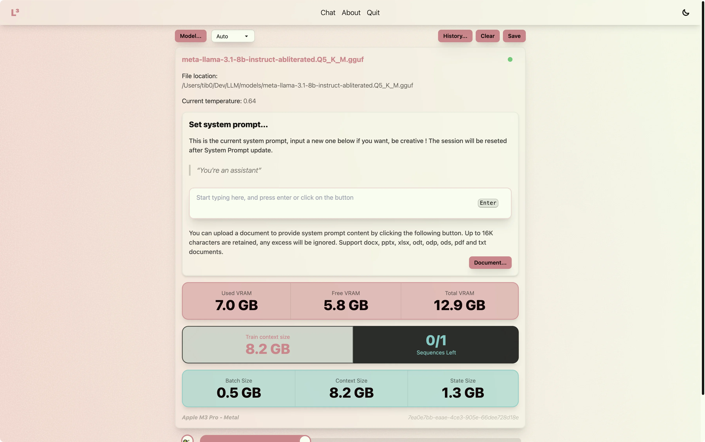

# L³, Local Llama

<p align="center">
  
</p>
<p align="center" style="font-size:18px; font-weight:800; margin: 5px;">
  v0.0.9
</p>
<p align="center" style="font-size:18px; font-weight:600; margin-bottom: 10px;">
  Local Llama also known as L³ is designed to be easy to use, with a user-friendly interface and advanced settings.
</p>

<p align="center" style="margin: 5px;">
  L³ enables you to choose various gguf models and execute them locally without depending on external servers or APIs.
</p>
<p align="center" style="margin: 5px;">
  You can save conversation history and retrieve it later.
</p>

<p align="center" style="margin: 5px;">
  With L³, you have complete control over the models used and their configuration, making it an ideal solution for anyone who wants to chat with LLM models offline.
</p>

### Features

<ul style="font-weight: 600;">
  <li>🔧 Customizable model settings</li>
  <li>🖥️ Windows, Linux & Mac supported</li>
  <li>📞 Save conversation history</li>
  <li>✈️ Offline</li>
  <li>💸 Free</li>
</ul>

## Summary

- [💻 Install](#install)
- [📸 Screenshots](#screenshots)
- [🔧 Settings](#settings)
- [❔️ How it Works](#how-it-works)
- [⬇️ Use from source](#use-from-source)
- [👨‍💼 Dependencies](#dependencies)
- [📜 License](#license)

## Install

### Find a gguf model

You can download a model from [Hugginface](https://huggingface.co/models?search=gguf). Any gguf
model will be compatible with Local Llama.

### Mac OS

<details>
  <summary>
    M1, M2, M3 processors..
  </summary>

1. Download the latest MacOS.arm.local-llama.zip file from
   [here](https://github.com/tib0/local-llama/releases/latest).
2. Uncompress the zip
3. Run the file `Local Llama.app`.
</details>

</br>
<details>
  <summary>
    Intel processors... 
  </summary>

1. Download the latest MacOS.x64.local-llama.zip file from
   [here](https://github.com/tib0/local-llama/releases/latest).
2. Uncompress the zip
3. Run the file `Local Llama.app`.
</details>

### Windows

<details>
  <summary>
    Exe installer 
  </summary>

1. Download the latest Windows.local-llama.exe file from  
   [here](https://github.com/tib0/local-llama/releases/latest).
2. Run the file `Local Llama.exe`. It will start an installer wich copy mandatory files to the
   right place (`%USERPROFILE%\appData\Roaming\"Local Llama"` and
   `%USERPROFILE%\appData\Local\local-llama`).
3. Launch the app `Local Llama`.
</details>

</br>
<details>
  <summary>
    Msi installer 
  </summary>

1. Build and make the app from sources by looking at [Use from source](#use-from-source)
   section.
2. Navigate to the `out` folder within your project's root directory, where you will find the
generated file.
</details>

### Linux

<details>
  <summary>
    Deb and rpm
  </summary>

1. Build and make the app from sources by looking at [Use from source](#use-from-source)
   section.
2. Navigate to the `out` folder within your project's root directory, where you will find the
generated file.
</details>

</br>
<details>
  <summary>
    Dmg
  </summary>

1. Install appdmg module ``npm i -D appdmg``
2. Navigate to the file ``forge.config.mjs:45`` and uncomment the dmg maker.
3. Build and make the app from sources by looking at [Use from source](#use-from-source)
   section.
4. Navigate to the `out` folder within your project's root directory, where you will find the
generated file.
</details>

## Screenshots

### Light and dark theme

<p align="center">
  
  
</p>

### Settings panel

<p align="center">
  
</p>

### Responsive window

<p align="center">
  
  
</p>

## Settings

### Details

<p align="center">
  
</p>

- **Model...**: This button is used to load a new model into the application. It open up a
  browse window. The model can be any `.gguf` llama model. If you want you can find models at
  [Hugginface](https://huggingface.co/models?search=gguf).
  > ##
  >
  > ### GGUF
  >
  > The GGUF (Generative GPT Unified Format) is a file format used to store the outputs of
  > LLMs. It's a compressed binary format that allows for efficient storage and loading of
  > generated text.
  >
  > #
- **Auto**: This dropdown is used to select where computations are performed. On Macos, in
  newer M type processor you can only select `auto` or `metal` option. On Windows, you can
  choose `auto`, `none` or `vulkan` option.
- **History...**: This button will open a file browser window, allowing you to choose the
  history file to load. History files are JSON representations of your conversations.
- **Clear**: This button clear the history and reset the current session.
- **Stop**: This button will abort the current prompt operation.
- **Save**: This button is used to save the current session into a file. The file is a JSON
  representation of the conversation. File extension is `.lllh`
- **Slider**: This slider is used to control the temperature of the next user prompt.

  > #
  >
  > ### Temperature
  >
  > The temperature parameter in Large Language Models (LLMs) is used to control the
  > "temperature" or randomness of the generated text, which affects the model's fluency and
  > creativity. Higher temperatures lead to more diverse and creative outputs, while lower
  > temperatures result in more coherent but less novel text. Think of it like a thermostat for
  > your AI's writing style!
  >
  > - **Low Temperature (.01 - .7)** – Setting the temperature to a value of less than .7 makes
  >   the model’s output more deterministic and repetitive.
  > - **Mid Temperature (.7 - 1.3)** – Promotes creative and diverse text generation, but may
  >   result in less coherent or grammatically correct output.
  > - **High Temperature (>1.3)** – Very creatives text generation, it can result in incoherent
  >   answer, or repetitive loops inside generated text.
  > - **Default Temperature (0)** – Extremly determinitic, no fantasy. The model generates text
  >   that is the most predictable, based on the probability distribution learned during its
  >   training.
  >
  > ##

- **Model name**: This toggle button is used to display extended informations about the model.
- **Document...**: This button allows you to select a document and insert its content into the
  system prompt. Keeps only the first 16K characters found inside the document.

### Extended informations

By clicking on the "Model name" toggle, you can view detailed information about the currently
selected model.

<p align="left">
  
</p>

You can update the system prompt in here:

<p align="left">
  
</p>

> ##
>
> ### System prompt
>
> A system prompt in Large Language Models (LLMs) is a specific instruction or question that
> helps the model understand the context and goals of the task it's being asked to perform.
>
> ##

## How it works

Local Llama integrates Electron and llama-node-cpp to enable running Llama 3 models locally on
your machine.

The app interacts with the llama-node-cpp library, which encapsulates the Llama 3 model within
a node.js module, ensuring smooth compatibility with both Electron and native code.

### File stored locally

Upon launching the application, a folder structure is created to store history, models, and
logs. This folder is located under your current user folder, which is represented by
`%USERPROFILE%` in Windows and `~` in MacOS/Linux. When you utilize a document to generate a
prompt, the document parser employs `.cache` folder to create temporary files.

The folder structure is organized as follows:

    .
    ├── ...
    ├── .cache
    │   ├── ...
    │   ├── local-llama
    │   │   ├── logs
    │   │   │   └── Local-Llama.log
    │   │   ├── history
    │   │   │   └── 2024-02-31T19-42-42.042Z.lllh
    │   │   ├── models
    │   │   │   └── llama.gguf
    │   │   └── ...
    │   └── ...
    └── ...

### Uninstall

Find below the steps to unistall Local Llama from your computer.

<details>
  <summary>
    Mac OS
  </summary>

1. Delete `Local Llama.app`
2. Remove the folder located here `~/.cache/local-llama`, it contains log, history and model
folder.
</details>

</br>

<details>
  <summary>
    Windows
  </summary>

1. Go to Settings > Applications > Uninstall, click on uninstall on "Local Llama".
2. Remove the folder located here `%USERPROFILE%\appData\Roaming\"Local Llama"`
3. Remove the folder located here `%USERPROFILE%\appData\Local\local-llama`
4. Remove the folder located here `%USERPROFILE%\.cache\local-llama`.
</details>

## Use from source

### Copy

Clone this git repository.

```bash
$ git clone https://github.com/tib0/Local-Llama
```

### Install

```bash
$ npm i
```

### Development

```bash
$ npm run start
```

### Build

```bash
$ npm run build
```

### Package

```bash
$ npm run package
```

### Make

```bash
$ npm run make
```

For Windows users, creating an MSI installer requires having the Wix Tools installed on your
local machine. For more information and guidance sees
[here](https://learn.microsoft.com/en-us/microsoft-edge/webview2/samples/wv2deploymentwixcustomactionsample#step-3---install-wix-toolset-build-tools).

### Requirements

**Node.js (22.x or higher)** - Local Llama requires a compatible version of Node.js to run.

**Npm (10.x or higher)** - Local Llama requires a compatible version of npm to run.

**Python (3)** - Python 3 is used during node-llama-cpp build.

**GGUF Model** - Local Llama uses the llama-cpp as its core AI engine. It can use any gguf
models. If you want, you can find model at
[Hugginface](https://huggingface.co/models?search=gguf)

**4GB RAM** - While it depends on the model size, it is recommended to have at least 4GB of
free RAM to run this app.

## Dependencies

- **electron-forge-plugin-vite-esm** by _fozziethebeat_: Fix the issue with esm interop embeded
  in electron app [here](https://github.com/fozziethebeat/electron-forge-plugin-vite-esm).

- **node-llama-cpp v3.0.0-beta** by _withcatai_: Awsome node wrapper for llama
  [here](https://github.com/withcatai/node-llama-cpp).

- **Typescript v5.x**

- **React and React dom v18.x**

- **Electron v31.x**

- **Electron Store v8.x**

- **Forge v7.x**

- **Tailwind CSS v3.x**

- **DaisyUI v4.x**

- **Prettier v3.x**

- **React Markdown v9.x**

- **React Syntac Higlighter v15.x**

- **Rehype v15.x**

- **Remix v15.x**

- **uuid v10.x**

- **officeparser v4.x**

## License

CC-BY-NC-ND :

> ##
>
> #### You are free to:
>
> - **Share** — copy and redistribute the material in any medium or format. The licensor cannot
>   revoke these freedoms as long as you follow the license terms.
>
> #### Under the following terms:
>
> - **Attribution** — You must give appropriate credit, provide a link to the license, and
>   indicate if changes were made . You may do so in any reasonable manner, but not in any way
>   that suggests the licensor endorses you or your use.
> - **Non Commercial** — You may not use the material for commercial purposes .
> - **No Derivatives** — If you remix, transform, or build upon the material, you may not
>   distribute the modified material.
> - **No additional restrictions** — You may not apply legal terms or technological measures
>   that legally restrict others from doing anything the license permits.
>
> #### Notices:
>
> You do not have to comply with the license for elements of the material in the public domain
> or where your use is permitted by an applicable exception or limitation.
>
> #### No warranties are given:
>
> The license may not give you all of the permissions necessary for your intended use. For
> example, other rights such as publicity, privacy, or moral rights may limit how you use the
> material.
>
> ##
>
> _Find out more [here](./LICENCE.md)_

# Have fun exploring Local Llama!

<p align="center">
  
</p>
