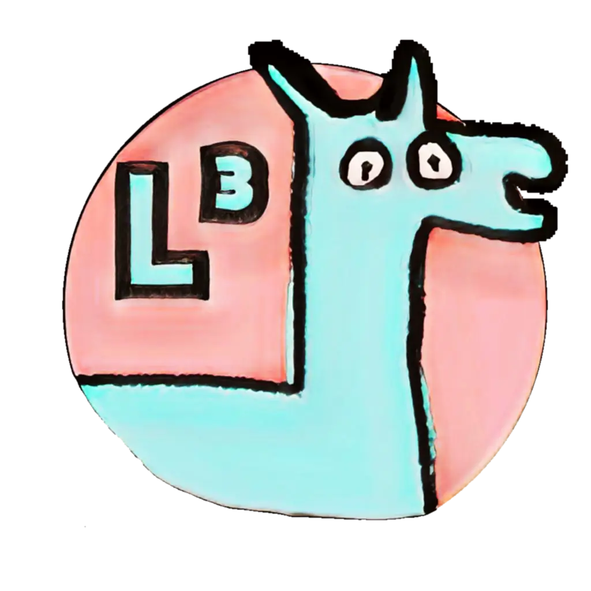

# local-llama

Local Llama is an electron app that runs Llama 3 models locally.

## Feature

- ✅ Locally run llama models
- ✅ Use GPU or CPU
- ✅ Set temperature
- ✅ Customize system prompt
- ✅ Save conversation history

## Installation

Download the latest release from [here](https://github.com/tib0/local-llama/releases).

## Screens

### Dark theme


### Light theme


## App settings

Settings are available in the app. 

You can customize your system prompt 

## Project Setup

### Install

```bash
$ npm i
```

### Development

```bash
$ npm run start
```

### Build

```bash
$ npm run build
```

### Package

```bash
$ npm run package
```

### Make

```bash
$ npm run make
```

## Made with

**React**

**Electron**

**Forge**

**Tailwind CSS**

**DaisyUI**

**Prettier**

**electron-forge-plugin-vite-esm**: Fix the issue with esm interop embeded in electron app
[here](https://github.com/fozziethebeat/electron-forge-plugin-vite-esm).

**node-llama-cpp**: Awsome node wrapper for llama
[here](https://github.com/withcatai/node-llama-cpp).

## License

> 
> #### You are free to:
> 
>  - **Share** — copy and redistribute the material in any medium or format. The licensor cannot revoke these freedoms as long as you follow the license terms.
> 
> 
> #### Under the following terms:
> 
>  - **Attribution** — You must give appropriate credit , provide a link to the license, and indicate if changes were made . You may do so in any reasonable manner, but not in any way that suggests the licensor endorses you or your use.
>  - **NonCommercial** — You may not use the material for commercial purposes .
>  - **NoDerivatives** — If you remix, transform, or build upon the material, you may not distribute the modified material.
>  - **No additional restrictions** — You may not apply legal terms or technological measures that legally restrict others from doing anything the license permits.
> 
> 
> #### Notices:
> You do not have to comply with the license for elements of the material in the public domain or where your use is permitted by an applicable exception or limitation.
> 
> No warranties are given. The license may not give you all of the permissions necessary for your intended use. For example, other rights such as publicity, privacy, or moral rights may limit how you use the material.
> 
*Find out more [here](./LICENCE.md)*

# Logo

